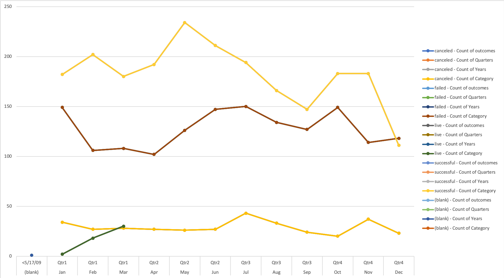

# Bootcamp: UCB-VIRT-DATA-PT-03-2020-U-B-TTH
## An Analysis of Kickstarter Campaigns
3/11/2020
Bootcamp Module 1: Kickstarting with Excel
Performed Data Analysis on Kickstarter data to uncover trends using Excel

### Dataset Used:
Kickstarter Global Dataset 
[KickstarterDataSet](https://courses.bootcampspot.com/courses/140/files/34981/download?wrap=1)

### Charts Generated

### Statistical Analysis Run
* Mean 
* Median 
* Standard Deviation
* Upper-Lower Quartile Range (Q3-Q1)

### Chart Types Used
* Histograms (stacked and unstacked)
* Box and Whisker
* Line Graph

### Trends Analyzed 
* Goal and Pledged amounts for Successful and Failed Campaigns across various countries and category types.
* Categories in specific countries and displayed their outcomes visually by use of histrograms
*

