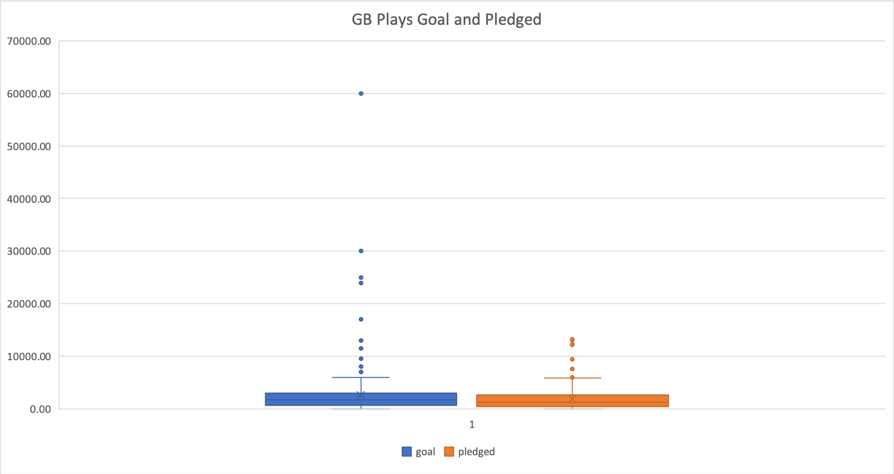

# Bootcamp: UCB-VIRT-DATA-PT-03-2020-U-B-TTH
## An Analysis of Kickstarter Campaigns
3/11/2020
Bootcamp Module 1: Kickstarting with Excel
Performed Data Analysis on Kickstarter data to uncover trends using Excel

### Dataset Used
Kickstarter Global Dataset 
[KickstarterDataSet](https://courses.bootcampspot.com/courses/140/files/34981/download?wrap=1)

### Excel Spreadsheet Generated
[Kickstarter](data-1-1-3-StarterBook.xlsx)

### Charts Generated

### Statistical Analysis Run
* Mean 
* Median 
* Standard Deviation
* Upper-Lower Quartile Range (Q3-Q1)

### Chart Types Used
* Histograms (stacked and unstacked)
* Box and Whisker
* Line Graph

### Trends Analyzed 
* Goal and Pledged amounts for Successful and Failed Campaigns across various countries and category types
* Categories in specific countries and displayed their outcomes visually by use of histrograms
* Impact of Quarter of Campaign on amount Pledged

### Data Driven Recommendations
1. Country & Campaign Specific
  * To increase the probability of a successful campaign, a US based theatre campaign would be advised to keep the Goal amount under the Median Pledged amount of $3,167.
  * All campaigns in Mobile Games category had an outcome of failed; thereby, I would recommend any Campaigns of this category to seek alternatives.
  * For Sub Category Plays in Great Britain the median pledged was $1,887 and as such successful campaigns should look to stay under this threshold.
2. Across all countries and categories, it is advisable to begin the campaign between **March-July**. The months of August-February have resulted in far fewer successful campaigns and significantly more failed campaigns. The best success to failed campaign ratio appears in **April** while the highest number of successful campaigns occurs in **May**. 
3. Outside of the US and GB across all categories, the success rate was only 35.6% whereas it was **55.4% for US and GB** (when taken together as a group). Consequently it is recommended to initiate the campaign within US or the GB.
