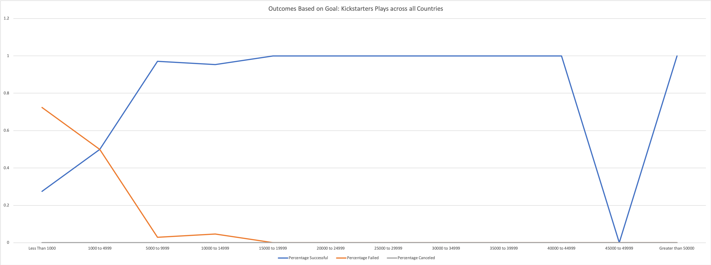
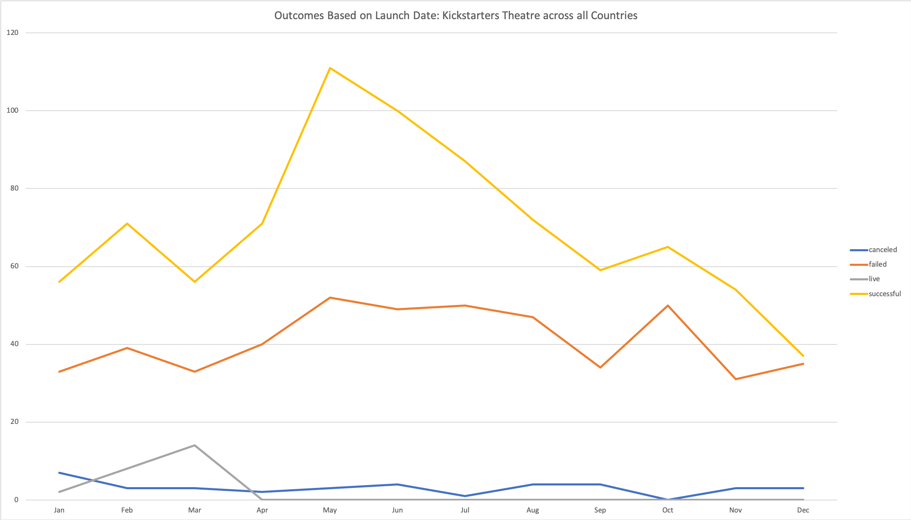

# Bootcamp: UCB-VIRT-DATA-PT-03-2020-U-B-TTH
### Bootcamp Challenge #1 - 3/15/2020
Bootcamp Challenge 1: Module Kickstarting with Excel

### Dataset Used
Kickstarter Global Dataset 
[KickstarterDataSet](https://courses.bootcampspot.com/courses/140/files/34981/download?wrap=1)

### Excel Spreadsheet Generated
[Challenge 1](data-1-1-3-StarterBook.xlsx)

### Chart Types Used
* Line Graph

### Trends Analyzed and Charts Generated
1. Outcomes of a Kickstarter campaign based on the Goal amount of the kickstarter campaign

   * Outcomes included: Successful, Failed, and Canceled; Live campaigns were excluded
   * Countries included: All countries
   * Goal amounts mostly segmented into ranges of 5,000
   * Sub category of the Campaign filtered to "plays"
2. Outcomes of a Kickstarter campaigns based on the month of the launch date of the campaign

* Outcomes included: Successful, Failed, Live, and Canceled
* Countries included: All countries
* Category of the Campaign filtered to "theatre"

### Data Driven Recommendations
These recommendations are based off the trends observed in the charts shown above. Each recommendation acknowledges its own limitations. Each recommendation strives to increase the probability of a successful kickstarter campaign as indicated by the analysis done.

**Definitions**
* Monthly success rate = Number of successful campaigns / total number of campaigns for the month.
* Percentage of successful campaigns per month = Number successful campaigns / total number of campaigns for the months

1. **Start your Theatre kickstarter campaign between April-July.** 
The highest number of successful campaigns (111) was seen in the month of May, which not only had the best monthly success rate (66.86%) but also accounted for the greatest percentage (10.55%) of all successful theatre kickstarter campaigns among all months. Starting the campaign in April, May, June, July yielded 62.83%, 66.87%, 65.36%, 63.04% respectively monthly success rates for all theatre campaigns. The average success rate for a month was 59.44%. While the months of September and November also posted monthly success rates above 60%, there were fewer overall campaigns than there were in the months of April-July.

*Data Source Used: Outcomes Based on Goals*

2. **Avoid starting your Theatre kickstarter campaign in December.** 
Not only the fewest successful campaigns (37) but also the fewest total theatre kickstarter campaigns were seen in the month of December. December had the lowest monthly success rate (49.33%) and also accounted for only (7.01%) of all successful theatre kickstarter campaigns among all months. The average success rate for a month was 59.44%, over 10% higher than the success rate shown by campaigns launched in December.

*Data Source Used: Outcomes Based on Launch Date*

3. **Goal amount should be $5,000+ for plays kickerstarter campaigns.** 
To obtain an understanding of the relationship between successful campaigns and goal amount, it was first beneficial to segment the data into buckets or ranges of values. In this analysis we analyzed campaigns with goal amounts < $1,000, $1,000-$4,999, then $5k increments until $50,000 and finally $50,000+. 

The data shows that the campaigns analyzed across all countries with a sub category of plays, less than 30% of successful campaigns had goals less than $1,000, and only 50% were successful with a goal between $1,000 and $4,999. Over 97% of all plays campaigns were successful with goal amounts $5,000-$9,999, over 95% success rate from $10,000-$14,999, and 100% success rate for over $15,000 though with a sample size of 35 accounting for just 2.5% of the dataset.

Statistically there appears to be a distinct disadvantage to those plays campaigns with a goal amount less than $5,000.

*Data Source Used: Outcomes Based on Goals*

**Limitations**
1. The dataset analyzed looked at Plays across all countries. As the exercise in the module showed, the success rate of campaigns that were started either in the US or GB had significantly greater chances than that of campaigns started in the rest of the world. 
2. The year by year distribution of the outcomes based on launch date was not analyzed. In order to establish if the trends demonstrated by the data are still relevant in recent years or are mostly skewed by a large datasets from years past, a year by year segementation would be required.
3. When analyzing the trends for outcomes based on launch date, the analysis took into consideration the category of Theatre but did not take into account the Sub Categories of Theatre, thus the granular view of these trends is not known. It could be that a certain sub category of Theatre such as plays is significantly skewing the data or it could be a representative trend throughout all sub categories, but without more information the trends remains unknown.

**Suggestions**
1. For limitation 1, additional charts on further segmenting the data to chart the individual countries relationship with plays campaigns and success rate to establish which countries this trend holds for.
2. For limitation 2, in addition to the aggregate view, we should generate charts that are segemented year by year to see if the same trends related to Launch Date and success rate holds throughout time.
3. For limitation 2, additional charts on further segmenting the data to chart the individual sub categories of the parent category of Theatre to observe which sub categories of theatre may be skewing the data one way or another.
